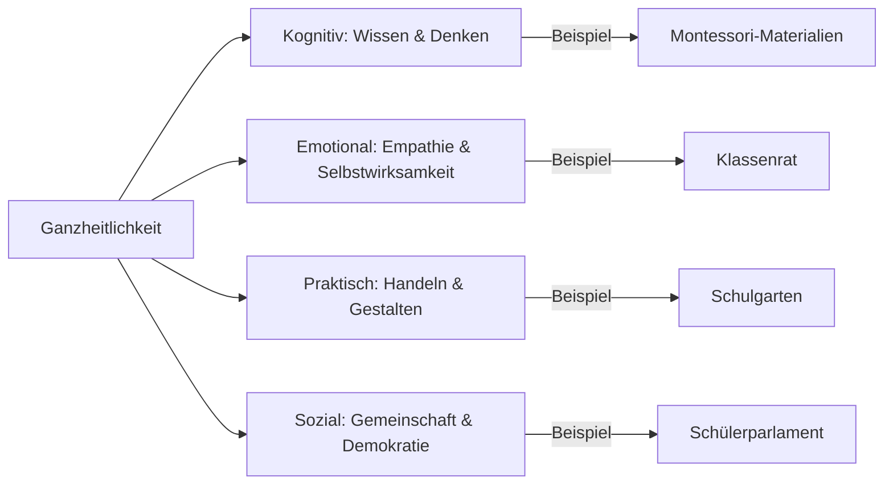

# Willkommen im How-To-Wiki

Dieses Wiki bietet Anleitungen und Ressourcen zur Erstellung eines Wikis mit [Jekyll](https://jekyllrb.com/) 
und [GitHub Pages](https://pages.github.com/). 

   

## Inhaltsverzeichnis
- [Tools and Technologies](tools-and-technologies/)
- [Command Line Interface (CLI)](tools-and-technologies/cli/)
- [Markdown Cheatsheet](cheatsheets/markdown/)
- [GitHub Cheatsheet](cheatsheets/cs_github/)
- [Weitere Cheatsheets](cheatsheets/)

# Reformpädagogik
> *„Erziehung ist kein Formungsprozess, sondern ein Wachstumsprozess.“*
> — **Maria Montessori**

---

## Inhaltsverzeichnis
- [Definition](#definition)
- [Historische Entwicklung](#historische-entwicklung)
    - [Schlüsselpersonen](#schlüsselpersonen)
    - [Zeitstrahl](#zeitstrahl)
- [Kernprinzipien](#kernprinzipien)
- [Kritik & Kontroversen](#kritik--kontroversen)
- [Praxisbeispiele](#praxisbeispiele)
- [Reformpädagogik & Digitalisierung](#reformpädagogik--digitalisierung)
- [Weiterführende Materialien](#weiterführende-materialien)

---

## Definition {#definition}
Die **Reformpädagogik** ist eine **bildungsphilosophische Bewegung**, die zu Beginn des 20. Jahrhunderts als Gegenentwurf zum autoritären, lehrerzentrierten Unterricht entstand. Ihr Kernanliegen ist die **Befreiung des Lernens**: Lernende sollen als **aktive Gestalter:innen** ihrer Bildung verstanden werden.

**Zentrale Merkmale**:
- Selbstbestimmtes Lernen
- Ganzheitliche Entwicklung („Kopf, Herz, Hand“)
- Demokratische Mitbestimmung
- Praxisorientierung („Learning by Doing“)

---

## Historische Entwicklung {#historische-entwicklung}

### Schlüsselpersonen {#schlüsselpersonen}
| Name               | Beitrag                                                                 | Werk (Jahr)                     |
|--------------------|-------------------------------------------------------------------------|---------------------------------|
| **Maria Montessori** | Wissenschaftliche Beobachtung; spezielle Lernmaterialien              | *Il Metodo* (1909)              |
| **Rudolf Steiner**  | Anthroposophie; ganzheitliche Entwicklung durch Kunst und Handwerk     | Waldorfschule (1919)            |
| **Célestin Freinet**| Demokratische Schule; „Natürliche Methode“                             | *L’École Moderne* (1940er)      |
| **Peter Petersen**  | Jena-Plan; altersgemischte „Familienklassen“                          | *Der kleine Jena-Plan* (1927)    |

### Zeitstrahl {#zeitstrahl}
- **1907**: Erste „Casa dei Bambini“ (Montessori, Rom)
- **1919**: Gründung der ersten Waldorfschule (Stuttgart)
- **1933–1945**: Unterdrückung durch NS-Ideologie
- **1960er**: Wiederbelebung im Zuge der 68er-Bewegung
- **21. Jh.**: Integration digitaler Tools (KI, OER)

---

## Kernprinzipien {#kernprinzipien}
### 1. Selbstbestimmtes Lernen

  
<strong>Mehr Details</strong>

  <ul>
    <li><strong>Freie Arbeit</strong>: Kinder wählen Lerninhalte selbst (z. B. Montessori „Arbeitszeit“).</li>
    <li><strong>Projektlernen</strong>: Fächerübergreifende Projekte (z. B. „Wir bauen ein Insektenhotel“).</li>
    <li><strong>Herausforderung</strong>: Balance zwischen Freiheit und Struktur.</li>
  </ul>

### 2. Demokratie als Lernprinzip
- **Klassenrat**: Regelmäßige Versammlungen zur Konfliktlösung.
- **Schülerparlamente**: Mitbestimmung bei Schulregeln.
- **Kritik**: Zeitaufwand und Machtgefälle.

### 3. Ganzheitlichkeit

